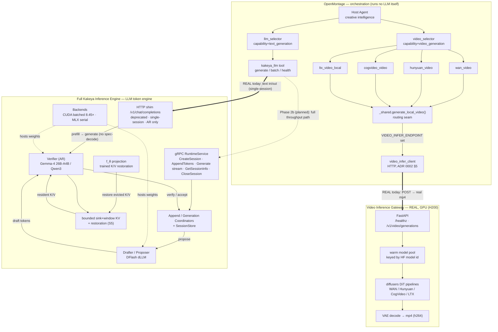

# ADR 0002 — Unifying OpenMontage's local video models behind a warm inference backend

- **Status:** Proposed (routing seam implemented; warm-server reference left to operators)
- **Date:** 2026-06-20
- **Deciders:** OpenMontage maintainers
- **Supersedes framing of:** the "run the 4 open-source video models *on Kakeya*" request
- **Related:** ADR 0001 (Kakeya text integration), `tools/video/_shared.py`, `tools/video/video_selector.py`

---

## 0. Binding engineering guidelines (no fallback / mock / fake / simplify)

> Added 2026-06-20 once real GPU (H200, 144 GB) was provisioned. These are
> **binding** for this integration and supersede the earlier "ship client + mock
> tests, defer the server" stance.

1. **No fake / no mock as a correctness gate.** The integration's correctness is
   proven against **real models on real GPU**. Mock HTTP servers may remain only as
   fast *unit* checks of pure functions (payload building, parsing, clamping); they
   **do not** count as evidence the integration works. The pass/fail gate is the
   **real** integration test against a live GPU-served endpoint.
2. **No fallback as a hiding place.** A real integration test must hit the **real
   gateway / real Kakeya server** and fail loudly if it is unreachable — it must
   **not** silently pass by routing to the in-process path, a stub, or a cached
   result. (When no GPU endpoint is configured, the real test **skips**, it never
   fakes a pass.)
3. **No simplify.** Generate with real model weights, a real VAE decode, and write a
   real, ffprobe-verifiable `.mp4`. "It returned 200 with some bytes" is not enough;
   the output must be a decodable video of the requested dimensions/frames.
4. **Real evidence is recorded.** Each real run records model id, device, dims,
   frame count, file size, and ffprobe stream info in the loop log.

The in-process diffusers path in `_shared.py` remains as an **operational** option
for users without a gateway, but it is **not** the thing under test here and is never
used to make a gateway integration test pass.

## 1. Context & the reframed goal

Follow-up to ADR 0001. The maintainer correctly observed that OpenMontage *does*
use four open-source models in its **video_generation** providers — all
`runtime = LOCAL_GPU`:

| Tool | Provider | Model | Pipeline |
|------|----------|-------|----------|
| `wan_video` | wan | Wan 2.1 (1.3B / 14B) | `WanPipeline` |
| `hunyuan_video` | hunyuan | HunyuanVideo 1.5 | `HunyuanVideoPipeline` |
| `cogvideo_video` | cogvideo | CogVideoX (2B / 5B) | `CogVideoXPipeline` |
| `ltx_video_local` | ltx | LTX-2 | `LTXPipeline` |

The reframed goal: **don't replace an OpenMontage module — instead unify these
four models behind ONE warm inference backend** that serves OpenMontage's
orchestration (`video_selector`) and returns the video stream, rather than each
tool cold-loading its own diffusers pipeline in-process.

This is a *good* goal. It targets a real inefficiency (§3).

## 2. The hard finding (技术硬伤): Kakeya cannot host these models

The specific mechanism — "run the 4 models **on the Kakeya inference engine**" —
is **not feasible with Kakeya as it exists.** Evidence from the Kakeya source:

1. **Kakeya is an LLM *token* engine.** Its entire gRPC contract
   (`proto/kakeya/v1/runtime.proto`) is `CreateSession` / `AppendTokens` /
   `Generate` (server-streaming **token ids**) / `CloseSession` /
   `GetSessionInfo`. There is **no tensor / image / latent / video message type**.
2. **"Diffusion" in Kakeya means text-diffusion LLMs** (`Qwen3-0.6B-MDLM`) — a
   token-decoding strategy, not image/video diffusion. (`proposer/sparse_logits.py`,
   `v04/build_restored.py`: `num_diffusion_steps` over a token vocabulary.)
3. **Its differentiating features are autoregressive-decode concepts** — bounded KV
   cache, K/V restoration, speculative proposer/verifier. WAN/Hunyuan/CogVideo/LTX
   are **DiT video-diffusion** models: they iteratively denoise latent *video
   tensors* and VAE-decode to frames. There is no growing KV cache, no token
   draft/verify loop — **none of Kakeya's features apply.**
4. **The only "multimodal" note** (Kakeya ADR 0008 §2) is about feeding image/audio
   bytes *into* an LLM (vision-language **input**); the **output is still tokens**.
   No video-serving, no VAE decode, no frame output path exists.

**Conclusion:** putting video diffusion "on Kakeya" would mean building an entirely
new diffusion-serving backend *inside Kakeya* (a large upstream change, out of
OpenMontage's scope), and even then Kakeya's value-add would not transfer to it.
We will **not** pursue that. We decouple the *goal* (unified warm backend) from the
*claim* (it must be Kakeya).

## 3. The real inefficiency we ARE fixing

Today all four tools delegate to `generate_local_video()` in
`tools/video/_shared.py`, which calls `load_diffusers_pipeline()` →
`Pipeline.from_pretrained(model_id)` **on every invocation**:

- **Cold model load per call** — multi-GB weights re-loaded each time; no warm reuse.
- **No VRAM pooling / admission control** — concurrent calls race to OOM.
- **No batching** — independent clips can't share a forward pass.
- **Couples OpenMontage to a full local `torch`+`diffusers` install** even when a
  capable GPU box exists elsewhere on the network.

OpenMontage already has the *correct pattern* for the fix: `generate_ltx_modal_video()`
routes to a standalone HTTP inference server (`MODAL_LTX2_ENDPOINT_URL`) instead of
loading in-process. We generalize that to all four local models.

## 3a. Integrated architecture diagram

Rendered: [`kakeya-openmontage-architecture.png`](kakeya-openmontage-architecture.png)
(source: [`kakeya-openmontage-architecture.mmd`](kakeya-openmontage-architecture.mmd)).
The full Kakeya engine is shown with its real internals — **gRPC RuntimeService**,
**Verifier** (AR), **Drafter/Proposer** (DFlash dLLM), **f_θ** projection, and the
bounded sink+window KV + restoration — alongside the (real-today) single-session
HTTP shim and the planned gRPC throughput path.



**How to read it.** OpenMontage stays a thin orchestrator. Video requests fan out
through the four tools → one routing seam → the **real** GPU gateway (warm diffusers
→ real mp4). Text requests go through `kakeya_llm`; **today** they hit Kakeya's
single-session HTTP shim (which wraps only the Verifier — pure AR, no spec-decode,
hence the 500-on-concurrency finding I8). The **full** engine's throughput path
(Drafter + Verifier + f_θ + bounded-KV restoration over the gRPC RuntimeService) is
Phase 2b — drawn here to show where it slots in.

## 4. Decision

Introduce a **video inference gateway** seam: an optional, standalone, warm
HTTP server that hosts the four models, which the local video tools route to when
configured (`VIDEO_INFER_ENDPOINT`), falling back to in-process diffusers otherwise.

- **Engine-agnostic by design.** The gateway can be a thin FastAPI+diffusers
  service, a ComfyUI/SD-server, the existing Modal LTX endpoint generalized — or, if
  Kakeya ever grows a diffusion backend, Kakeya. OpenMontage only depends on the
  HTTP **contract** (§5), never on a specific server.
- **Additive & safe.** When `VIDEO_INFER_ENDPOINT` is unset, behavior is byte-for-byte
  the current in-process path. Default users are unaffected.
- **Availability widens correctly.** With a gateway configured, the local video tools
  become available **without** a local `torch`/`diffusers` install (the server owns
  them) — exactly the "thin orchestrator talks to a warm backend" architecture.

### The honest synthesis (the actual "unification")

OpenMontage's **local inference plane** = two engines behind selectors:

```
            video_selector                         llm_selector
                  │                                     │
        capability=video_generation           capability=text_generation
                  │                                     │
   ┌──────────────┴───────────────┐                     │
   │  VIDEO INFERENCE GATEWAY      │              ┌──────┴───────┐
   │  (warm WAN/Hunyuan/CogVideo/  │              │   KAKEYA     │
   │   LTX behind one HTTP API)    │              │  (LLM tokens)│
   └───────────────────────────────┘              └──────────────┘
        DiT video diffusion                       AR / text-diffusion LLM
```

Text → Kakeya (ADR 0001). Video → a diffusion gateway (this ADR). Both warm, both
behind OpenMontage's existing selectors. That is the real unification — it just does
**not** force one engine to do two fundamentally different kinds of inference.

## 5. Server contract (so any backend can implement it)

`VIDEO_INFER_ENDPOINT` points at a base URL exposing:

**`GET /healthz`** → `200 {"status":"ok","models":["Wan-AI/Wan2.1-T2V-1.3B-Diffusers", ...]}`

**`POST /v1/video/generations`** with JSON:

```jsonc
{
  "model": "<hf model id, e.g. Wan-AI/Wan2.1-T2V-1.3B-Diffusers>",
  "prompt": "…",
  "operation": "text_to_video" | "image_to_video",
  "width": 832, "height": 480,
  "num_frames": 81, "num_inference_steps": 30,
  "fps": 16,
  "seed": 1234,                       // optional
  "negative_prompt": "…",             // optional
  "image_b64": "<base64 png>"         // required iff operation == image_to_video
}
```

Response — any one of (probed by content-type):

- `Content-Type: video/mp4` (or `application/octet-stream`) → raw mp4 bytes, **or**
- `application/json` → `{"video_url": "https://…"}` (OpenMontage downloads it), **or**
- `application/json` → `{"video_b64": "<base64 mp4>"}`.

This mirrors the existing Modal endpoint convention and OpenAI's
`/v1/images/generations` shape — deliberately boring and easy to implement.

## 6. Consequences

**Positive**

- Warm models, VRAM pooling, batching, admission control — all become possible by
  running ONE gateway, with zero change to OpenMontage's orchestration.
- The four tools + `video_selector` keep their current interface; only the execution
  backend moves behind an HTTP seam.
- Decouples OpenMontage from a heavy local `torch`/`diffusers` install when a gateway
  exists elsewhere.

**Real evidence (Iteration 4 — H200, 144 GB)**

- The gateway server is now **real and shipped** (`services/video_infer_gateway/`),
  not deferred. Verified on an H200: `CogVideoX-2b`, 720×480, 49 frames → a real
  **h264** mp4 (ffprobe-confirmed) in ~21 s, driven end-to-end by
  `CogVideoVideo.execute()` → gateway (`mode=remote_gateway`). Binding test:
  `tests/integration/test_real_gpu.py` (skips, never fakes, when no endpoint).

**Negative / risks**

- One more configuration surface (`VIDEO_INFER_ENDPOINT`).
- Disk, not VRAM, is the warm-pool ceiling: each model family's text encoder is
  multi-GB, so a 23 GB box holds ~one model at a time (I9). Provision disk for the
  number of models you want warm simultaneously.

**Explicitly rejected**

- Forcing video diffusion onto Kakeya's token runtime (§2).
- Claiming Kakeya "serves the video stream" — it does not and cannot.

## 7. Follow-ups (the loop)

- Reference gateway implementation (FastAPI + diffusers, model warm-pool + queue) as a
  separate deployable, conforming to §5.
- Batching + VRAM-aware admission inside the gateway (the real throughput win).
- Optional: extend the seam to `image_generation` local providers (`local_diffusion`).

See `docs/adr/0001-kakeya-integration-loop-log.md` (Iteration 3) for the test loop.
