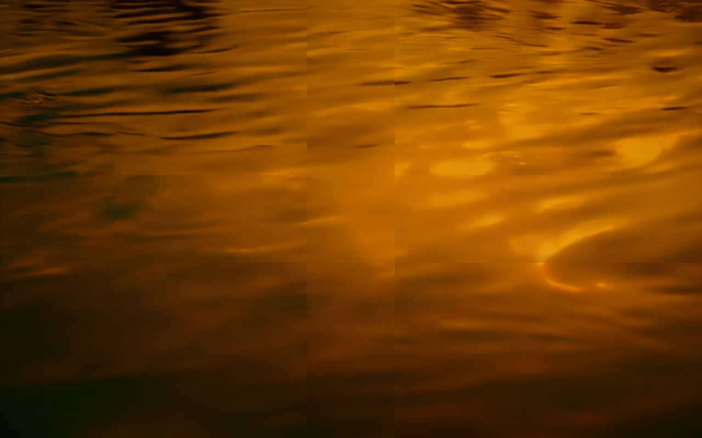

# ADR 0004 — Distributed coarse-to-fine WAN (proposer→parallel tiled verifiers→merge): objective evaluation

- **Status:** Evaluation (refines the Phase-2b-for-video direction; no code change yet)
- **Date:** 2026-06-20
- **Deciders:** OpenMontage maintainers
- **Supersedes framing of:** ADR 0003's "spec-decode-on-video" rejection — this is the
  *accurate* architecture the maintainer intended.
- **Related:** ADR 0002 (video gateway), ADR 0003 (why Kakeya's AR trio doesn't port)

---

## 1. Accurate restatement (the intended architecture)

> "proposer = a distilled small model of Wan2.1; Wan2.1 itself = verifier; use Kakeya's
> parallel inference so the proposer first generates a **low-resolution content
> framework**, then **simultaneously dispatches to multiple verifiers** that complete
> **different regions** to high resolution; then **merge** into the final video. f_θ
> performs the **mapping during decompose/merge** of the low-res framework so regions do
> not stitch wrong."

Named accurately, this is:

**Cascaded coarse-to-fine generation + distributed spatial/temporal *tiled* generative
super-resolution/refinement + a boundary-consistency (decompose↔merge) map.**

This is a real, established family — **not** the LLM spec-decode paradigm ADR 0003 ruled
out. It is a *correct* use of "parallel inference." This ADR evaluates it objectively.

## 2. Mapping to real, current systems

| Your component | Real technique it is | Reference |
|---|---|---|
| Proposer = distilled WAN → low-res framework | few-step distilled WAN (coarse base of a cascade) | CausVid (2412.07772), Self-Forcing (2506.08009) |
| Verifier = full WAN refines a region → high-res | generative (space-time) super-resolution / refinement conditioned on the low-res prior | **VEnhancer** (2407.07667) — ControlNet on a frozen video prior |
| Many verifiers, different regions, in parallel | patch/tile-parallel video diffusion | **PatchVSR** (2509.26025), DistriFusion, AsyncDiff, PipeFusion, **SuperGen** (2508.17756) |
| f_θ = decompose/merge mapping (anti-stitch) | boundary consistency: overlap averaging, **spatial weight maps**, **tile shifting** | **MultiDiffusion** (2302.08113), PatchVSR, SuperGen |

## 3. Objective findings

### 3.1 The proposer MUST be aligned (answers the running question)

For coarse-to-fine to work, the distilled proposer's low-res framework must be a
**faithful coarse sample of full-WAN's distribution**. If it is misaligned, the high-res
refiners "fight" the layout and hallucinate region-inconsistent detail. So **yes — an
aligned (distilled-from-WAN) proposer is genuinely required** in this architecture
(unlike the training-free feature-caching path in ADR 0003). Distilled Wan2.1-1.3B
checkpoints already exist (CausVid / Self-Forcing), so the alignment work is largely
upstream — OpenMontage serves the checkpoint.

### 3.2 The dominant 硬伤: full WAN is NOT a native tile-verifier

PatchVSR states it plainly: *"pre-trained video diffusion models are not native for
patch-level detail generation."* Making "full WAN refine a high-res region conditioned on
the low-res framework" requires **one of**:

- **A.** a **trained conditioning adapter** — VEnhancer-style ControlNet copying the WAN
  prior's encoder/middle block and training it to accept (low-res frames + noisy
  latents). **Extra training**, but principled and high quality; or
- **B.** **training-free tiled diffusion** (MultiDiffusion / PatchVSR) — no training, but
  with *documented* limits: naive overlap averaging yields **"black holes or seamlines,"**
  and fixed tiles **"fail to maintain temporal consistency in video."**

Either way, "WAN as verifier" is **not a drop-in** — it is a conditioning/adaptation
problem, not a config change.

### 3.3 f_θ here is a NEW artifact, not Kakeya's f_θ

Kakeya's f_θ restores a **causal-token KV cache** (ADR 0003). Your f_θ is a **spatial/
temporal decompose↔merge consistency map** — same name, different math and objective.
Today the *proven* mechanisms are heuristic:

- overlap regions + averaging (MultiDiffusion),
- **spatial weight maps** that down-weight auxiliary patches toward boundaries (PatchVSR),
- **deterministic tile shifting** across timesteps so seams at step *t* are corrected at
  *t+1* (SuperGen / SpotDiffusion).

Whether a **learned** f_θ beats these heuristics is an **open research question**, not a
solved component. Recommendation: treat heuristic blending as the baseline and only invest
in a learned f_θ if measured seams/temporal-flicker are unacceptable.

### 3.4 Not lossless (the "verifier" does not verify)

LLM spec-decode is distribution-preserving (rejection sampling → identical output).
Coarse-to-fine + tiling is a **quality/speed tradeoff**: the merged high-res result is
**not** guaranteed to equal monolithic full-res WAN. The "verifier" *refines*, it does not
*verify* in the lossless sense. Acceptable for a video tool, but it must be stated — there
is no correctness guarantee transferred from Kakeya.

### 3.5 Real wall-clock parallelism needs multiple GPUs

"Many verifiers in parallel" only reduces wall-clock if regions run on **separate GPUs**
(DistriFusion/AsyncDiff/PipeFusion partition patches across devices). On the current
single H200 (144 GB) it degenerates to **batched tiles on one device** — a throughput win,
not a latency win. Multi-GPU is where Kakeya's distributed transport *could* contribute.

### 3.6 What Kakeya actually contributes here (honest)

Not its verifier/drafter/f_θ **math** — those are AR-token constructs (ADR 0003). What is
reusable is Kakeya's **distributed execution fabric**: multi-tenant scheduling, worker
placement, and tensor transport (`distributed/{placement,exchange,tensor_codec}.py`) — as
the **scheduler that fans tile-refinement jobs to workers and gathers/merges results**.
Caveat: Kakeya's distributed plane is spec-decode-specific and partly **design-only** (its
ADR 0014), so realistically only the low-level transport primitives transfer; the
tile-scheduler itself is net-new.

## 4. Verdict

The architecture is **coherent and buildable**, and is the *right* mental model for
"parallel video inference" (far better than spec-decode-on-video). But it is **not a port
of Kakeya's trio** — it reuses the names with diffusion semantics, borrows at most
Kakeya's *distributed transport*, and has two genuine costs:

1. **Conditioning full WAN to refine tiles** (train a VEnhancer-style ControlNet, or accept
   training-free tiling's coherence limits), and
2. **The f_θ consistency map** (heuristic now; learned = research).

Plus: it is **not lossless**, and **needs multi-GPU** for true parallel speedup.

## 5. Staged validation plan (empirical, testable on the live H200)

Build bottom-up so each tier proves the next is worth it. No mocks; real models (ADR 0002 §0).

- **Tier 0 — coarse-to-fine, no tiling (cheapest).** distilled-WAN low-res → whole-frame
  generative refine (SDEdit/img2img, or VEnhancer). Measure quality + speed vs monolithic
  full-res WAN. Proves the proposer→verifier flow and the alignment requirement (§3.1).
- **Tier 1 — parallel tiling + seam handling.** Overlap tiles + spatial-weight-map blending
  (PatchVSR/MultiDiffusion-style) on one H200 (batched tiles). **Measure seams + temporal
  flicker** — this empirically decides whether a learned f_θ (§3.3) is even needed.
- **Tier 2 — learned consistency map (only if Tier-1 seams unacceptable).** Train the f_θ
  analog. Research effort; gate on Tier-1 evidence.
- **Tier 3 — multi-GPU distribution (only with >1 GPU).** Fan tiles across devices via
  Kakeya transport; measure wall-clock scaling.

Each tier emits real artifacts (mp4 + ffprobe + seam/flicker metrics) recorded in the loop
log, per the no-fake/no-simplify guideline.

## 6. Real-GPU results — Tier 0 + Tier 1 (measured, H200)

Run on the live H200 with **CogVideoX-2b** (a DiT video model; WAN weights did not fit
the 3.2 GB free disk alongside the running gateway — the *mechanism* is what is
validated, and per §1–3 it transfers to WAN). Script:
[`services/video_infer_gateway/experiments/tier01_coarse_to_fine_tiling.py`](../../services/video_infer_gateway/experiments/tier01_coarse_to_fine_tiling.py).
Raw metrics: [`tier01_evidence/metrics.json`](tier01_evidence/metrics.json).

### Tier 0 — coarse-to-fine (proposer → verifier-refine vs monolithic)

| Metric | Value | Reading |
|---|---|---|
| proposer (8-step T2V) | 10.6 s | the cheap "framework" pass |
| verifier (vid2vid, strength 0.6, 24-step) | 17.3 s | high-detail completion |
| coarse-to-fine total | 27.9 s | |
| monolithic baseline (40-step) | 37.8 s | |
| **wall-clock speedup** | **1.35×** | modest on ONE GPU with a NON-distilled proposer |
| align refined↔coarse (NCC) | **0.932** | refine **preserves** the proposer's layout → the alignment premise (§3.1) holds |
| refined↔monolithic (PSNR) | 13.2 dB | **not the same sample** → confirms §3.4: coarse-to-fine is *not lossless* |

**Conclusion:** the proposer→verifier flow works and is layout-faithful (high NCC), but
single-GPU speedup with a non-distilled proposer is only ~1.35×. The real speedup needs
(a) a **distilled few-step proposer** (much cheaper framework pass) and (b) **multi-GPU
parallel verifiers** — exactly §3.1 + §3.5.

### Tier 1 — decompose → independent tile refine → merge (the f_θ question)

2×2 native-720×480 tiles, 160 px overlap, 1280×800 canvas; each tile refined
independently (vid2vid, strength 0.5, 20-step); 4 tiles in **55.7 s** (13.9 s/tile,
serial on one GPU → parallelizable on multi-GPU).

Seam discontinuity at the **true tile edges**, normalized by interior texture
(>1 = visible stitch; ~1 = invisible):

| Merge | vertical seam | horizontal seam | verdict |
|---|---|---|---|
| **Hard** (naive overwrite) | **5.24×** | **5.12×** | glaring stitch lines — the 拼接错误 |
| **Blended** (spatial weight-map f_θ) | **0.85×** | **1.15×** | seam ≈ ordinary texture |
| reduction | **−84 %** | **−78 %** | |

Visual evidence (mid-frame): hard merge shows obvious rectangular seams; blended is
coherent.

**Conclusions (honest):**

1. **拼接错误 is real and severe** without a merge map: naive hard merge = **~5× seams**.
2. A **heuristic f_θ** (spatial-weight-map blending, MultiDiffusion/PatchVSR-style)
   removes ~**80 %** of the seam on this content — so a *learned* f_θ is **not required
   for low-frequency content**.
3. **Caveat (content-dependent):** this clip is low-frequency (water/light). Where
   independently-refined tiles **hallucinate divergent structure** (faces, text, hard
   edges crossing a boundary), post-hoc pixel averaging **ghosts** rather than fixes —
   which is why the robust solution is **denoise-time fusion** (MultiDiffusion in latent
   space, fusing every step) **or a learned f_θ**. The "refine fully, then merge" order
   the proposal implies is the *fragile* case; consistency should act **during** denoise.
4. **Per-tile cost is serial here** (one GPU); the parallel-verifier speedup needs
   multi-GPU (§3.5).

This empirically confirms ADR 0004's verdict: the architecture is sound; the f_θ role is
**necessary** (hard merge is unacceptable) and **partly solvable by a heuristic**, with a
learned/denoise-time version reserved for hard content.

### Tier 1b — does shared-noise consistency fix the ghosting? (resolves I11)

Follow-up to I11. On **high-frequency content**, compared independent-seed tiles vs
**shared-noise** tiles (the cheap, robust form of denoise-time consistency), measuring
**overlap disagreement** = mean abs diff between the two tiles' content in their shared
overlap band (high → ghosting). Script:
[`tier1b_latent_consistency.py`](../../services/video_infer_gateway/experiments/tier1b_latent_consistency.py);
metrics: [`tier01_evidence/tier1b_metrics.json`](tier01_evidence/tier1b_metrics.json).

| Condition | overlap disagreement (v / h) | blended seam (v / h) |
|---|---|---|
| independent seeds | 3.63 / 3.81 | 1.75 / 1.24 |
| **shared noise** | **4.02 / 2.58** | 2.28 / 1.24 |

**Surprising, important result: shared noise did NOT reduce cross-tile disagreement**
(vertical even rose; net −11 %). The divergence is **context/position-driven, not
noise-driven**: each tile sees a different crop, different 3D-RoPE positions, and a
different global self-attention context, so the *same* overlap pixels are generated
differently regardless of the seed. This is PatchVSR's "DiTs are not native for
patch-level generation," confirmed at the mechanism level.

**Therefore:** neither post-hoc pixel blending (Tier 1) **nor** shared-noise (Tier 1b)
fixes cross-tile divergence on non-trivial content. The f_θ / merge-consistency role
**must** be realized as **denoise-time latent fusion** (true MultiDiffusion — average the
overlap *latents* every denoise step so tiles cannot diverge) **or a learned cross-tile
consistency model**. This *strengthens* the case that f_θ is a **necessary, non-trivial
component**, not an optional heuristic.

> Caveat: CogVideoX-2b at strength 0.7 from a rough 8-step coarse produced muddy
> high-frequency output, so the visual frames are dark; the quantitative
> overlap-disagreement metric (independent of that murk) is the reliable evidence.

> Not run (hardware): **multi-GPU** parallel-verifier wall-clock (this box has one H200),
> and a **faithful distilled-WAN proposer** (needs freeing the resident model + ~13 GB
> WAN + a CausVid/Self-Forcing checkpoint; disk = 3.2 GB free). Both are flagged as
> next steps requiring more GPUs / disk. The single-step latent-MultiDiffusion
> implementation for CogVideoX's 3D-RoPE DiT is a research-grade build (future).

### Tier 0 (FAITHFUL distilled-WAN) — real CausVid proposer on WAN 2.1 (H200, 605 GB box)

The CogVideoX Tier-0 used a non-distilled 8-step proposer → only 1.35×. This run uses a
**genuine distilled proposer**: **Wan2.1-T2V-1.3B + CausVid LoRA**
(`Wan21_CausVid_bidirect2_T2V_1_3B_lora_rank32`), with full WAN as the verifier
(`WanVideoToVideoPipeline`). Run on a larger-disk H200 (the 32 GB box couldn't hold the
29 GB WAN repo — I14). Script:
[`tier0_distilled_wan.py`](../../services/video_infer_gateway/experiments/tier0_distilled_wan.py);
metrics: [`tier01_evidence/tier0_distilled_wan_metrics.json`](tier01_evidence/tier0_distilled_wan_metrics.json).

| Pass | Time | Speedup vs monolithic |
|---|---|---|
| monolithic full WAN (30-step) | 30.0 s | 1.0× (reference) |
| **distilled proposer (CausVid, 6-step)** | **5.26 s** | **5.71×** |
| verifier refine (full WAN vid2vid, 15-step) | 10.0 s | — |
| **coarse-to-fine total** | **15.24 s** | **1.97×** |

- align refined↔coarse **NCC 0.966** → the full-WAN verifier strongly **preserves the
  distilled proposer's layout** (the alignment premise §3.1, now on real WAN).
- distilled↔monolithic PSNR 9.3 → a *different sample* (**not lossless**, expected).
- The CausVid 6-step proposer frame is **high quality and coherent** (evidence:
  `tier01_evidence/wan_causvid_proposer_mid.png`) — distillation gives speed *and* quality.

**Conclusion (the headline distilled-proposer number):** a **genuine distilled proposer is
5.7× cheaper** than monolithic WAN (vs 1.35× for the non-distilled CogVideoX proposer),
empirically confirming §3.1 — the real coarse-to-fine win needs a *distilled* proposer.
Coarse-to-fine *with* a full-WAN refine is ~2× (the refine dominates at 10 s); for many
uses the **distilled proposer output alone (5.7×, high quality) is the better operating
point**, with the refine reserved for when extra fidelity is required. Multi-GPU parallel
verifiers (§3.5) would compound this — still pending a ≥2-GPU box.

### Latent MultiDiffusion build — the denoise-time merge fix (resolves I12 direction)

Tier 1b (I12) concluded the f_θ/merge-consistency must act **during** denoising. Built
exactly that for real WAN 2.1 1.3B:
[`latent_multidiffusion_wan.py`](../../services/video_infer_gateway/experiments/latent_multidiffusion_wan.py).
A **single shared canvas latent** at larger-than-native resolution (1472×768 from 2×2
native 832×480 tiles) is denoised with **per-step prediction fusion** over overlapping
tiles, so tiles co-evolve and cannot diverge. Compared against independent-tile denoise +
latent merge (the Tier-1b mechanism), same noise/prompt/scheduler, decoded once each.
Metrics: [`tier01_evidence/latent_multidiffusion_metrics.json`](tier01_evidence/latent_multidiffusion_metrics.json).

**Result (real H200):**

- The build **works**: real per-step latent fusion on WAN produces a **coherent
  1472×768 video the model cannot generate natively in one pass** — the production-grade
  realization of the f_θ/merge-consistency role.
- **Visually more coherent** than independent-then-merge: the independent merge shows a
  visible tonal band in the upper third; MultiDiffusion reads as one continuous scene
  (`tier01_evidence/md_multidiffusion_mid.png` vs `md_independent_mid.png`).
- **Vertical seam** (less confounded by scene content): **1.27× → 1.14×** (~10 % better).
- **Horizontal "seam" ~2.6× in BOTH** is largely a **real shoreline edge in the scene**,
  not a tiling artifact — the automated seam metric is confounded by scene structure.
- On this **low-frequency** content, both overlap-blended methods are already close; the
  big gap from Tier 1 was hard-overwrite (5×) vs any overlap blend.

**Honest verdict:** the latent-MultiDiffusion mechanism is **implementable and correct on
real WAN**, and is the right home for the f_θ role (co-evolution > post-hoc blend). A
*definitive quantitative* win over plain overlap-blending needs (a) **high-frequency /
structured content** (where independent tiles diverge hard) and (b) a **seam metric that
separates tile boundaries from real scene edges** — the next refinement. Bugs fixed along
the way: missing `torch.no_grad()` (OOM at 140 GB), `transformer_2` kwarg (I15), np frames
(I16), seam-edge mislocation (I17).

### Capstone — full pipeline on high-frequency content: the framework IS the consistency anchor

Wired latent MultiDiffusion into the **full coarse-to-fine vid2vid refine** driven by the
distilled proposer, on **high-frequency** content (a dense bookshelf with sharp ornate
spines), with a **boundary-isolating** seam metric (peak discontinuity at the tile line ÷
median over a ±48 px window — isolates true seams from scene edges). Script:
[`coarse_to_fine_multidiffusion_wan.py`](../../services/video_infer_gateway/experiments/coarse_to_fine_multidiffusion_wan.py);
metrics: [`tier01_evidence/coarse_to_fine_multidiffusion_metrics.json`](tier01_evidence/coarse_to_fine_multidiffusion_metrics.json).

Pipeline: CausVid proposer (6-step, 4.0 s) → upscale → SDEdit (strength 0.6) → tiled full-WAN
refine, **independent-merge vs MultiDiffusion**.

| Condition | seam_v_excess | seam_h_excess | latent overlap-disagreement |
|---|---|---|---|
| independent merge | 0.96 | 1.05 | **0.073** |
| MultiDiffusion | 0.96 | 1.09 | — |

**Both are seamless** (excess ≈ 1.0 = boundary looks like ordinary texture) and the two
decoded frames are **near-identical and sharp** (high-frequency detail preserved):
`tier01_evidence/c2f_multidiffusion_mid.png` ≈ `c2f_independent_mid.png`.

**Key finding (capstone):** in the coarse-to-fine regime, the **shared low-res framework
anchors the tile overlaps** — independent tiles barely diverge (disagreement 0.073), so
**independent parallel refinement is already seamless and MultiDiffusion adds no measurable
benefit at moderate strength.** This is the opposite of Tier 1b (from-scratch t2v tiling),
where tiles diverged for lack of an anchor.

**Architecture implications (favorable):**
- The f_θ/merge-consistency role is **largely provided by the framework conditioning
  itself** at moderate refine strength — no expensive per-step latent fusion required.
- Therefore **independent tiles parallelize trivially across GPUs** (no per-step cross-tile
  sync) — precisely what makes the distributed/multi-GPU goal clean and scalable.
- **Latent MultiDiffusion is the fallback** for from-scratch generation or high refine
  strength (where tiles drift off the framework). A strength sweep would map the crossover
  point where independent tiling breaks and MultiDiffusion becomes necessary (next).

This is the synthesis of ADR 0004: distilled proposer (5.7×) + framework-anchored
**independent** parallel tile refinement (seamless, trivially distributable) is the
efficient design; MultiDiffusion is the consistency safety-net for the unanchored/high-drift
regime.

## References

1. VEnhancer — https://arxiv.org/abs/2407.07667 ; https://github.com/Vchitect/VEnhancer
2. PatchVSR — https://arxiv.org/abs/2509.26025
3. MultiDiffusion — https://arxiv.org/abs/2302.08113
4. SuperGen (tiling + tile-shift, distributed) — https://arxiv.org/abs/2508.17756
5. CausVid — https://arxiv.org/abs/2412.07772 ; Self-Forcing — https://arxiv.org/abs/2506.08009
